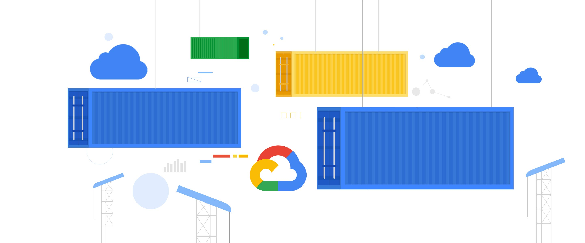

# GKE Best Practices

* Pick the right topology for your cluster: regional or zonal
* Regional cluster consist of three Kubernetes control planes with a higher availability
* Zonal clusters have a single control plane in a single zone
* Enable Cluster Auto-scaler to automatically resize node-pool based on demand
* Use Horizontal Pod Autoscaling to increase/decrease the number of pods based on load
* Enable auto-upgrade for the cluster and its nodes

