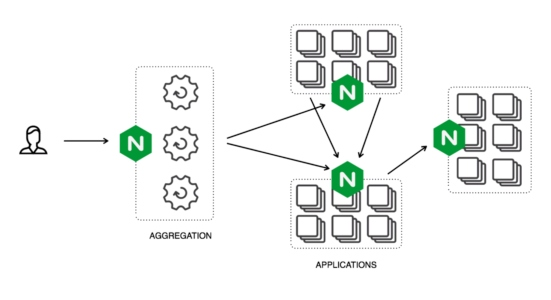

# Micro-Services

* A great fit for Kubernetes workloads
* Highly maintainable and testable
* Loosely coupled
* Independently deployable
* Organized around business capabilities
* Owned by a small team

