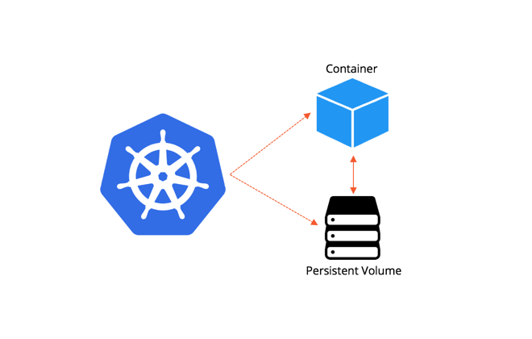

# Stateful Workloads

* Be mindful of stateful set constrains and underlying storage
* PVC and PV are designed to share storage between Containers not between Pods on GKE
* Single instance stateful application can fully rely on PVC
* Replicated stateful application will require [a more elaborate approach](https://kubernetes.io/docs/tasks/run-application/run-replicated-stateful-application/#statefulset)
* GCE Disk is the default choice, but there is an option to mount GCP Cloud Storage at [the cost of higher latency](https://cloud.google.com/storage/docs/gcs-fuse)
* For a streamlined deployment of stateful/highly-available workloads [Helm Charts](https://helm.sh/) likely to save you days of effort

