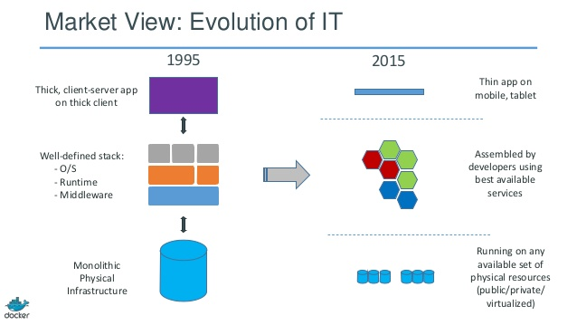

# Container Motivation

* Eliminates 'works on my machine' by escaping dependencies matrix
* Run applications side-by-side with predictable and portable deployments
* Achieves higher compute density - unlike VMs only libraries and settings are required
* Maintain immutable and tamper-proof images/environments
* Built-in orchestration to scale up to tens of thousands of nodes in seconds using Docker Swarm

