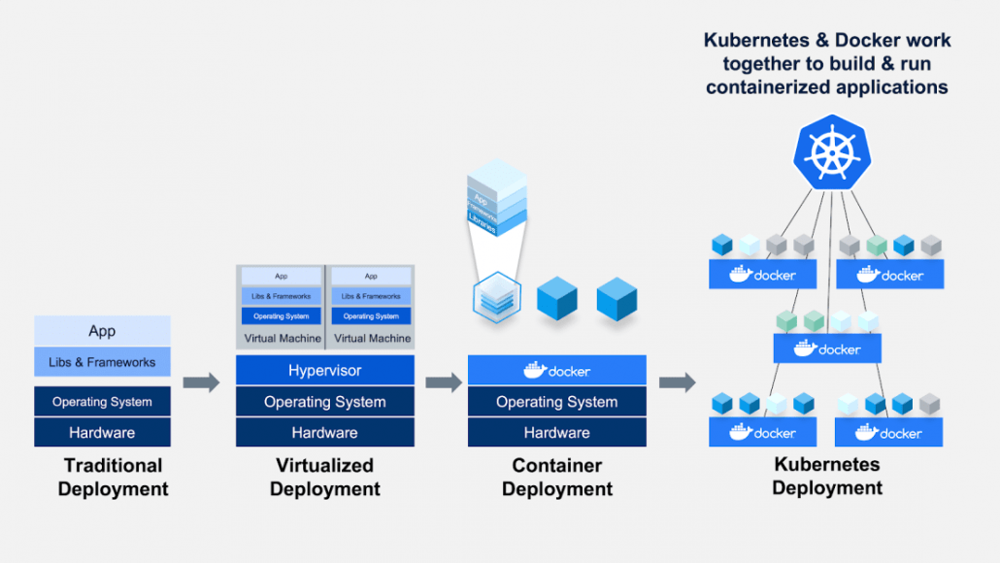

# From Docker to Kubernetes

* Kubernetes can run without Docker and Docker can function without Kubernetes
* Docker is a standalone software that can be installed on any computer
* Kubernetes can work with any containerization technology
* A container is a set of 1 or more processes that are isolated from the rest of the system
* Docker image, with your code, is guaranteed to behave the same way in every environment
* Kubernetes runs containers across multiple compute nodes whether VMs or a bare-metal servers

