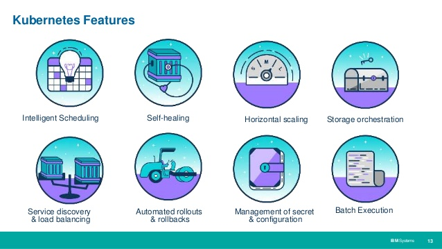

# Cluster Features

* Containers without orchestrations do not scale well
* Kubernetes designed to run billions of containers a week
* Networking with dual-stack: IPv4 & IPv6
* Horizontal Scaling
* Service Discovery and Load-Balancing
* Storage Orchestration
* Containers and Nodes self-healing
* Secrets and Configuration Management

