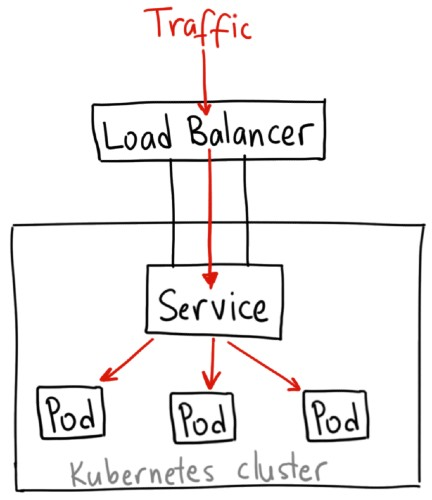

# Service

* A way to expose an application running on a set of Pods as a network service
* Kubernetes gives Pods their own IP addresses and a single DNS name
* Pod IP addresses may change when pods are restarted or re-scheduled to another node
* Pods are nonpermanent resources, service provides a persistent way accessing pods
* A service may expose multiple ports for pods
* Commonly used service types: `ClusterIP` and `LoadBalancer` integrated with GCP on GKE

