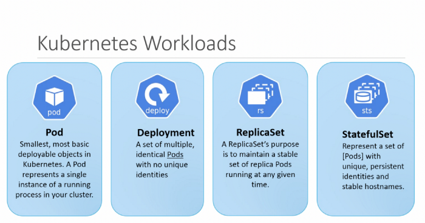

# Workloads

* Pods consist of one or more containers that share networking and host storage
* ReplicaSets are wrappers around Pods that simply let you manage the number of Pods you want running at a given time
* Deployment manages ReplicaSet, which in turn manages the number of Pods that should be running
* StatefulSets specialized for Pods that require persistent storage, MySql is good candidate for StatefulSet
* Services and End-Points provide a way for Pods to talk with each other
* Ingress is the glue between the outside world and your Services e.g. in a form of Http Load Balancer

