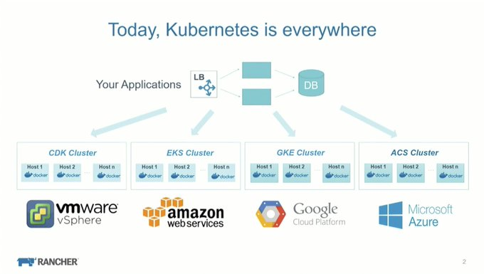

# History

* Originated in Google's Borg system that started in ~2003
* Google has been running [containerized apps for a decade](https://kubernetes.io/blog/2015/04/borg-predecessor-to-kubernetes/)
* Kubernetes first announced in [mid-2014](https://www.wired.com/2014/06/google-kubernetes/)
* Kubernetes first released v1.0 on 10th of July 2015
* Some [job ads](https://www.theregister.com/2020/07/13/ibm_kubernetes_experience_job_ad/) ask for 12 years experience in 2020
* Today, [thousands](https://www.weave.works/blog/weaveworks-named-a-top-kubernetes-contributor) of companies and tens of thousands of contributors are part of Kubernetes
* [Github lists](https://github.com/kubernetes/kubernetes/pulse/monthly) hundreds of active pull requests on a monthly basis
* [Thousands](https://stackshare.io/kubernetes) of companies are using Kubernetes in production in 2020

