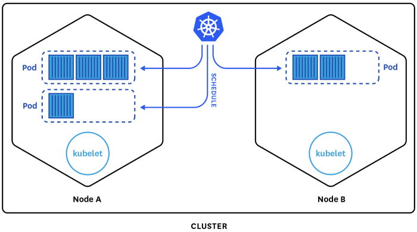

# What to do with Kubernetes

* Write applications that run across multiple operating environments: on-premises and on-the-cloud
* Leverage core capabilities for containers without imposing restrictions
* Decompose software into smaller parts with clear separation of concerns
* Isolate dependencies and make wider use of well-tuned, smaller components
* Deploy and update software at scale, Google started [2B containers](https://www.theregister.com/2014/05/23/google_containerization_two_billion/) a week in 2014
* Embrace DevOps practices for automated deployment, versioning, horizontal scaling, and rolling updates

