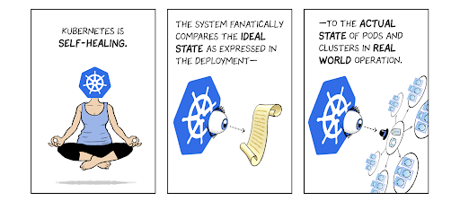

# Why Kubernetes?

*  Kubernetes is a hot technology today, there are, likely, [thousands of job openings](https://www.indeed.com/q-kubernetes-jobs.html?vjk=24dfa577a712a2fc)
* Users expect applications and services to be available 24/7
* Developers expect to deploy code multiple times a day with no downtime
* Companies desire more efficient use of cloud resources
* CIO's/CTO's crave cross-cloud compatibility
* Kubernetes offers fault tolerant and self-healing infrastructure
* Kubernetes supports automated horizontal scaling
* Kubernetes provides configuration, secrets and other management tools

