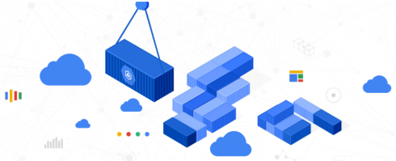

# GKE Features

* Fully managed Kubernetes with no need for us provision the underlying resources
* A container-optimized operating system maintained by Google
* Pod and cluster autoscaling and healing
* Identity and access management
* Security and compliance
* Integrated logging and monitoring
* Auto upgrade for Kubernetes version and auto-repair for nodes
* [Full-list of features](https://cloud.google.com/kubernetes-engine#all-features)

  