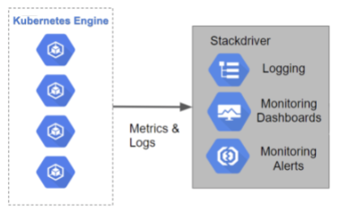

# Logging & Monitoring

* Scale-able applications and reliable service require insight into the run-time behaviour
* Kubernetes comes with a number of tools to monitor the cluster and its workloads
* [Resource metrics pipeline](https://kubernetes.io/docs/tasks/debug-application-cluster/resource-usage-monitoring/#resource-metrics-pipeline): container CPU and memory usage
* [Full metrics pipeline](https://kubernetes.io/docs/tasks/debug-application-cluster/resource-usage-monitoring/#full-metrics-pipeline): richer metrics, K8s can respond to these metrics by auto-scaling
* Different levels of monitoring: cluster, pool, node, pod and etc.
* Command-line tools and Restful API are available for automation
* GKE enriches Kubernetes with Cloud Logging and Monitoring, previously Stackdriver, integration

  