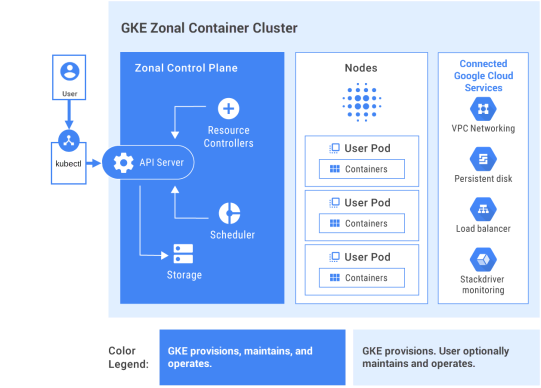

# What is GKE

* Google Kubernetes Engine is a managed environment for containerized applications using GCP
* GKE clusters are powered by the Kubernetes running on top of Google Compute Engine services

  
