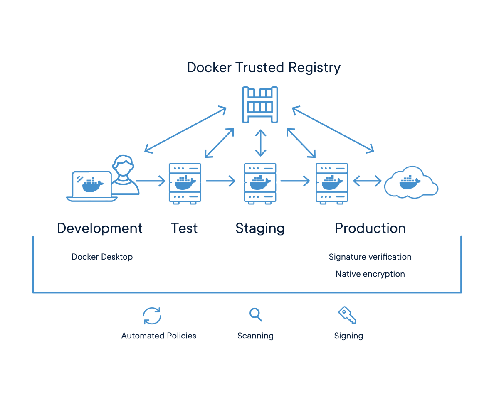

# Images & Repositories

* Run container based on images without known vulnerabilities
* Use most basic image that suits your requirements
* Remove processes and components from the images you don't require
* Implement continuous security vulnerability scanning
* Roll-out security updates using new images, avoid `apt-update` style patching
* Run your organization authorized images only
* Use private image repositories

