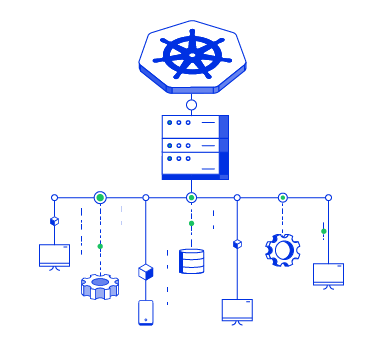

# Know Thy Deployment

* What is being deployed: image, components, vulnerabilities, and the pods configuration?
* Where it is being deployed: clusters and nodes?
* Does it run privileged?
* What other deployments it communicates with?
* What it can access: secrets, volumes, host, Kubernetes API, and GCP services?
* Is the deployment compliant with policies and security requirements?

