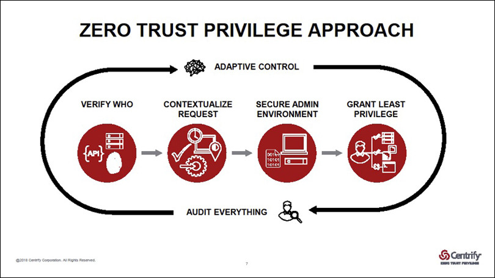

# Zero Trust

* A security concept that organization should not trust anything inside or outside of its perimeters
* Every access must be verified before it is granted
* "Castle-and-moat" mentality where focus is on defending the perimeter, assuming the insiders have been cleared, is no more suitable
* Single source of user identity
* User and services authentication and authorization
* Data and communication encryption at rest and on-the-wire
* Log and audit administrative access 

