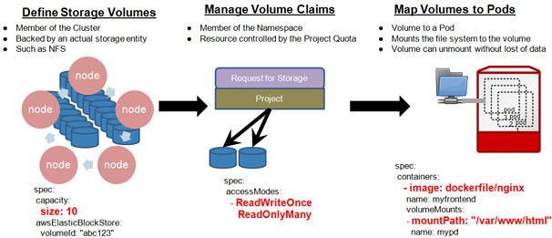

# Access Modes

* Access mode defines how Volume can be read from or written to
* `ReadWriteOnce` mounts the Volume as read-write to a single node
* `ReadOnlyMany` mounts a Volume as read-only to many nodes
* `ReadWriteMany` mounts Volumes as read-write to many nodes
* For most applications, Persistent Disks are mounted as ReadWriteOnce
* GCP Persistent disks do not support `ReadWriteMany`
* Other volume types e.g. NFS can support the `ReadWriteMany` accessMode, watch out for concurrency!

