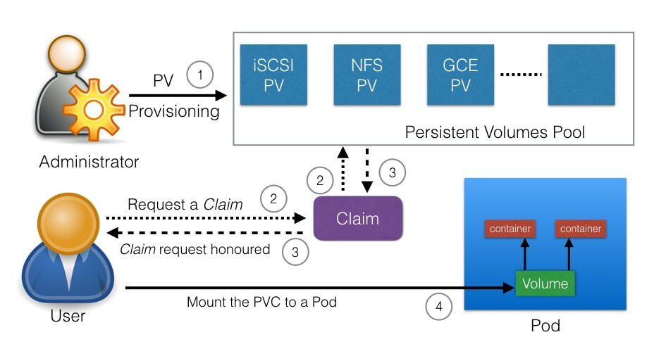

# Persistent Volume Claims

* Separate storage consumption from storage provisioning
* Cluster administrators make persistent volumes available
* App developers make use of those volumes in through claims
* GKE default StorageClass is dynamically provisioned using gcePersistentDisk
* Creating a Compute Engine Persistent Disk is a GCP task not a Kubernetes task, e.g.:
```
gcloud compute disks create --size=100GB --zone=us-central1-a demo-disk
```

[](https://sites.google.com/site/edxkubernetes/kubernetes-volume)
