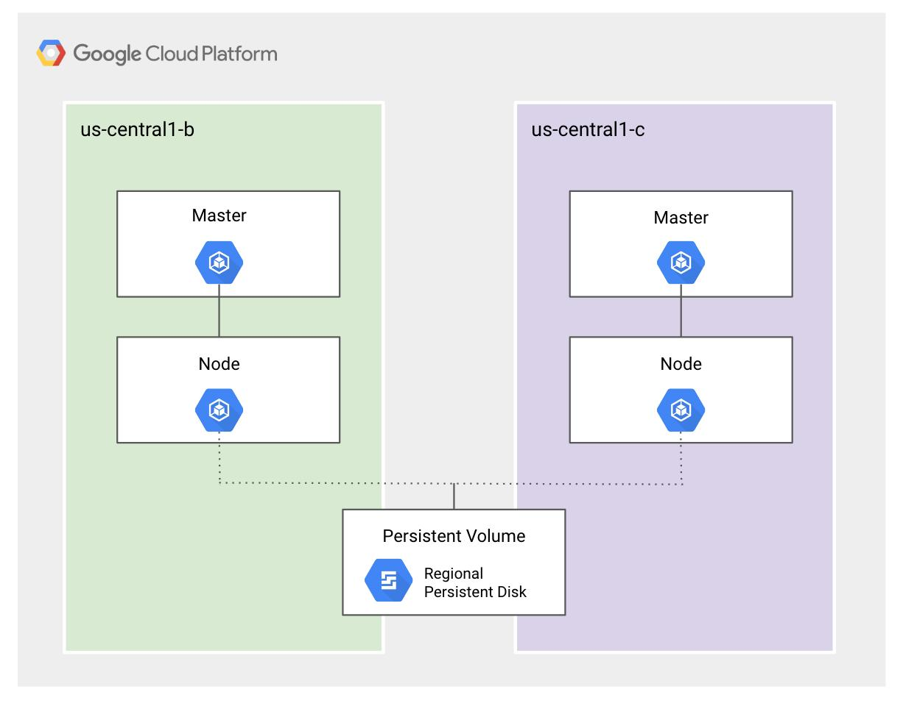

# Regional Persistent Disk

* A multi-zonal resource replicating data between ***two*** zones in the same region
* In the event of a zonal outage Kubernetes will failover to the other zone volume
* Regional persistent disks can be launched manually or dynamically
* Used for highly available stateful workloads
* Regional SSD persistent are for high availability and high performance requirements

