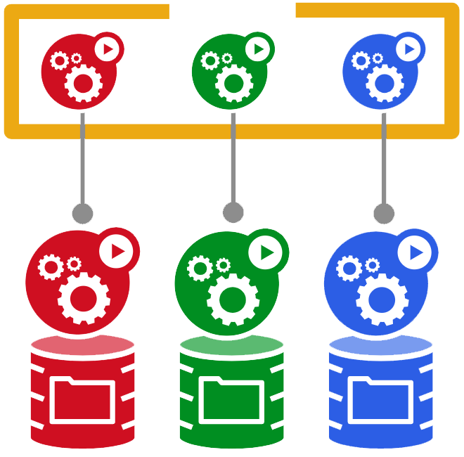

# Stateful Set

* StatefulSets are useful for stateful applications
* Deployment is a Pod template to run a set of replicas sharing Persistent Volume
* ReadWriteOnce not suitable for deployments due to deadlock
* StatefulSets maintain a persistent ordinal index and hostname for each Pod, but not an IP
* Deployment sequential ordered using the ordinal index
* Scaling and rolling updates are happen in reverse order

