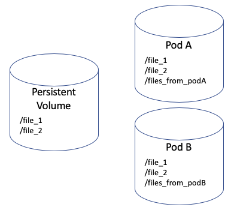

# Volumes

* Volume is a directory that is accessible to the containers in a Pod
* Volumes are attached to Pod and shared between containers the Pod
* Ephemeral volumes last only as long as the Pod
* Ephemeral volume types:  ConfigMap, emptyDir, Secrets, and downwardAPI or Pod Metadata
* Persistent storage is a block storage, or networked file systems
* Persistent storage must exist before Pod creation and storage will outlive Pod itself
* Persistent storage types: iSCSI volumes, NFS, Windows Share, gcePersistentDisk, and GPC Cloud Filestore
* Container in a Pod will start when all the volumes are ready to be mounted, type of persistent storage matters

